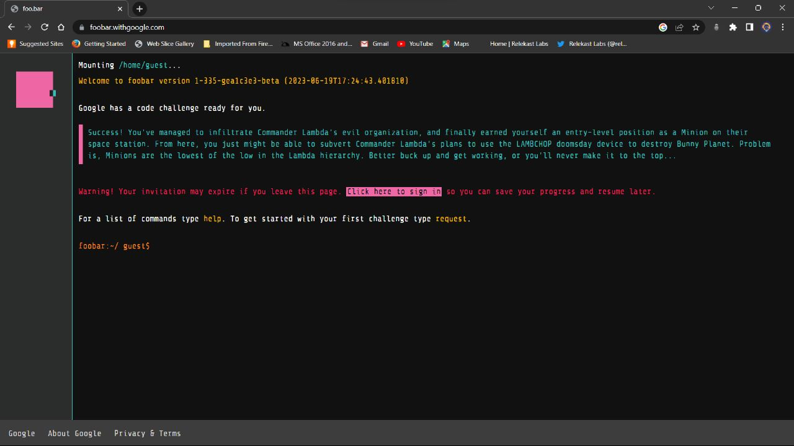

# Google Foobar

Welcome to the Google Foobar repository! This repository is a collection of solutions to the Google Foobar challenges. Google Foobar is an invitation-only coding challenge presented by Google. It consists of a series of programming problems across multiple difficulty levels.

## Introduction to Google Foobar

Google Foobar provides an opportunity for skilled developers to showcase their coding abilities and problem-solving skills. Participants are presented with a set of progressively challenging problems and are tasked with finding optimal solutions within a given time frame. Successful completion of the challenges may even lead to a potential invitation for further recruitment opportunities at Google.

## Contributing

We invite you to contribute your solutions to the Google Foobar challenges in this repository. To contribute, follow these steps:

1. Fork the repository to your GitHub account.
2. Create a new folder in the respective level directory for the problem you are solving (e.g., `Level-1`, `Level-2`, etc.).
3. Inside the problem's folder, create a text file named `problem_statement.txt` that contains the problem statement.
4. Create a solution file in the same folder with an appropriate title. For Python solutions, use the `.py` extension, and for Java solutions, use the `.java` extension.
5. Write your solution code in the solution file and provide any necessary explanations or comments.
6. Commit and push your changes to your forked repository.
7. Submit a pull request to the main repository.

Please make sure to follow the existing file structure and naming conventions in the repository.

## Disclaimer

The solutions provided in this repository are contributed by various developers and may not be the only or the most optimal solutions to the given problems. They are meant to serve as a reference and to foster discussion and learning among developers.

## Show Your Support

If you find this repository useful or appreciate the contributions made by developers, please consider starring the repository. Your support is greatly appreciated!

